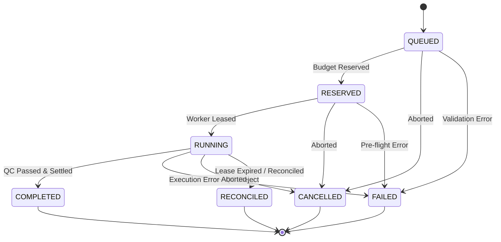

# R01 CONTRACTS & TYPED SCHEMAS — ARCHITECTURAL IMPLEMENTATION PLAN

**Repository:** `R01_contracts`  
**Architectural Layer:** Layer 0 (Foundation)  
**Specification Baseline:** v1.0.0 (Frozen Spec Candidate)  
**Document Status:** APPROVED FOR IMPLEMENTATION  
**Target Package:** `@avf/contracts` (TypeScript / JSON Schema Library)  
**Author:** AI Video Factory Architecture & Engineering  

---

## Executive Summary

`R01_contracts` is the foundational Layer 0 package for the AI Video Factory (AVF) ecosystem. It provides the immutable, single-source-of-truth contracts, JSON Schema Draft-07 / 2020-12 specifications, automatically compiled TypeScript types, runtime AJV validators, comprehensive positive/negative test fixtures, and the normative `FlowExecutionPort` test harness. 

Every downstream repository (R02 through R15) imports `@avf/contracts` to guarantee runtime boundary validation, zero contract drift, end-to-end type safety, and semantic interoperability between Track A (Browser Automation) and Track B (Direct FlowKit Bridge).

---

## 1. Blueprint Conformance & Repository Responsibilities

### 1.1 Responsibility (OWNS)
- **Canonical JSON Schemas:** Host, version, and validate Draft-07 / 2020-12 compliant schemas for all AVF domain entities, event envelopes, provider requests/results, browser commands, and execution results.
- **Automated TypeScript Type Generation:** Compile JSON Schema definitions into strongly-typed TypeScript definitions (`.d.ts` and `.ts`) via `json-schema-to-typescript`.
- **FlowExecutionResult Discriminated Unions:** Provide strongly-typed discriminated interfaces for all 10 `FlowExecutionPort` operations.
- **Runtime Validation Utilities:** Provide pre-compiled AJV validators for high-throughput in-memory payload validation with descriptive error reporting.
- **Comprehensive Fixture Library:** Host a minimum of $\ge 3$ positive and $\ge 3$ negative JSON test fixtures for each of the 6 primary schemas.
- **Common Conformance Test Harness:** Provide the standardized, transport-agnostic `FlowExecutionPort` test suite to verify semantic equivalence across R09 (Browser Worker) and R10 (FlowKit Bridge).

### 1.2 Does NOT Own (Boundaries & Exclusions)
- **Runtime State Storage & Persistence:** Does NOT own database connections, ORM schemas, migrations, or persistent state storage (owned exclusively by `R02_core_state`).
- **Business Logic & Workflow Execution:** Does NOT execute workflows, sagas, or domain business operations (owned by `R06_workflow` and domain engines R03, R04, R05, R11, R12).
- **Network I/O & Provider Execution:** Does NOT make HTTP, gRPC, WebSocket, or CDP network calls to external providers (owned by R07, R08, R09, R10).
- **UI Components:** Does NOT host frontend components or console interfaces (owned by `R13_operator_console`).

---

## 2. Inputs, Invariants & System Guarantees

### 2.1 Inputs
- Frozen contract definitions from `01_FROZEN_RELEASE/v1.0.0/FROZEN_SPEC_CANDIDATE/02_contracts/`.
- Technical hardening register from `05_IMPLEMENTATION/R01_PREIMPLEMENTATION_HARDENING.md`.

### 2.2 System Invariants Enforced
- **INV-001:** `Take` belongs to exactly one `Shot` and references exactly one `GenerationJob`.
- **INV-002:** `GenerationJob` references immutable `ShotVersion` and `PromptVersion` identifiers.
- **INV-003:** Every mutating operation contract requires a deterministic `idempotency_key` (SHA256, minimum 16 chars).
- **INV-006:** Generated artifact payloads require content checksums (`checksum_sha256`, 64 hex chars) and valid storage URIs.
- **INV-007:** Provider-specific parameters remain encapsulated within namespaced metadata / `provider_parameters` objects.
- **INV-010 & INV-011:** Separation of technical retries (same `PromptVersion`) from creative retries (new `PromptVersion`).
- **INV-014:** Strict boundary validation: all inter-service payloads must validate against canonical schema definitions.
- **INV-015:** Distributed tracing context (`trace_id`, `span_id`, `correlation_id`) enforced across all event envelopes.
- **INV-020:** Track A and Track B semantic equivalence across all 10 `FlowExecutionPort` operations.

---

## 3. Forensic Hardening Requirements Integration

This plan implements all 6 technical hardening items from `05_IMPLEMENTATION/R01_PREIMPLEMENTATION_HARDENING.md`:

| Hardening Item | Issue / Advisory | Implementation Approach in R01 |
|---|---|---|
| **Item 1: Schema Standardization** | Non-standard `$defs` and empty-string keys in raw schemas | Standardize all schema definitions to strictly conform to JSON Schema Draft-07 / 2020-12 using standard `$id`, `$schema`, `$defs`, and `$ref` keywords. Validate with AJV 2020. |
| **Item 2: 17 Normative Stages** | Documentation / code referencing 11 stages instead of 17 | Strictly model the authoritative 17 execution stages in schema enum definitions, TypeScript enums, and state machine validation tests. |
| **Item 3: Strongly-Typed Unions** | Open `result` object in `flow-execution-result.schema.json` | Implement explicit discriminated union types (`FlowExecutionResultMap`) for all 10 operations in TypeScript while keeping schema valid and extensible. |
| **Item 4: Automated Type Generation** | Manual type drifting risk | Implement `npm run build:types` script using `json-schema-to-typescript` with customized post-processing for discriminated unions and exported namespaces. |
| **Item 5: Comprehensive Fixtures** | Missing negative and boundary fixtures | Construct $\ge 3$ positive and $\ge 3$ negative fixtures per schema (total $\ge 36$ fixtures) covering missing required fields, type errors, regex violations, extra properties, and enum bounds. |
| **Item 6: Conformance Test Suite** | Disparate Track A and Track B testing | Implement an exportable test suite (`@avf/contracts/conformance`) defining behavioral tests for all 10 `FlowExecutionPort` operations to ensure drop-in interchangeability. |

---

## 4. Contract Inventory & Canonical Schema Architecture

### 4.1 Schema Directory Layout (`schemas/`)
```text
schemas/
├── domain-entities.schema.json      # Canonical entities: Project, Shot, ShotVersion, PromptVersion, GenerationJob, Take, AssetVersion, CharacterVersion, StyleVersion
├── event-envelope.schema.json       # Distributed event envelope with OpenTelemetry headers
├── provider-request.schema.json     # Normalized generation request submitted to provider adapters
├── provider-result.schema.json      # Normalized generation response with error taxonomy
├── browser-command.schema.json      # Discriminated FlowExecutionPort command contract (10 operations)
└── flow-execution-result.schema.json# Discriminated FlowExecutionPort execution result & error envelope
```

### 4.2 Entity and Schema Breakdown

#### A. `domain-entities.schema.json`
- **Schema ID:** `https://schemas.aivideofactory.com/v1/domain-entities.schema.json`
- **Definitions (`$defs`):**
  - `UUID`: RFC 4122 compliant UUID regex (`^[0-9a-fA-F]{8}-[0-9a-fA-F]{4}-[1-5][0-9a-fA-F]{3}-[89abAB][0-9a-fA-F]{3}-[0-9a-fA-F]{12}$`).
  - `Timestamp`: ISO 8601 UTC date-time string.
  - `CanonicalLifecycleStatus`: Enum (`QUEUED`, `RESERVED`, `RUNNING`, `COMPLETED`, `FAILED`, `CANCELLED`, `RECONCILED`).
  - `ExecutionStage`: Enum with all 17 normative stages:
    - *QUEUED:* `WAITING_FOR_ASSETS`, `PROMPT_READY`
    - *RESERVED:* `BUDGET_RESERVED`
    - *RUNNING:* `SUBMITTING`, `SUBMITTED`, `GENERATING`, `DOWNLOADING`, `DOWNLOADED`, `QC_RUNNING`
    - *COMPLETED:* `APPROVED`
    - *FAILED:* `EXECUTION_FAILED`, `QC_REJECTED`, `TIMEOUT`
    - *CANCELLED:* `ABORTED_BY_USER`, `ABORTED_BY_SYSTEM`
    - *RECONCILED:* `RECONCILED_SUCCESS`, `RECONCILED_TERMINAL`
  - `NormalizedError`: Object with `code` (9 standard codes), `message`, `retry_category` (4 categories), `suggested_backoff_ms`, `raw_provider_error`.
  - `Project`: Project entity definition with `project_id`, `title`, `aspect_ratio`, `entity_version`.
  - `Shot`: Shot entity definition with `shot_id`, `project_id`, `shot_number`, `current_version_id`.
  - `ShotVersion`: Creative shot definition with `duration_ms`, `action_description`, `character_refs`, `style_refs`, `asset_refs`.
  - `PromptVersion`: Target-specific compiled prompt with `positive_prompt`, `negative_prompt`, `parameters`, `ast_snapshot`.
  - `GenerationJob`: Execution tracking entity with `job_id`, `provider_id`, `idempotency_key`, `status`, `execution_stage`, `flow_track`, `lease_token`, `lease_expires_at`, `cost_credits`.
  - `Take`: Media output entity with `take_id`, `storage_uri`, `mime_type`, `byte_size`, `checksum_sha256`, `qc_status`, `qc_score`.
  - `AssetVersion`: Digital asset reference with `storage_uri`, `source_type`, `checksum_sha256`.
  - `CharacterVersion`: Character continuity model with `face_embedding_hash`, `reference_asset_ids`.
  - `StyleVersion`: Visual style reference with `lora_weights_uri`, `style_prompt_prefix`.

#### B. `event-envelope.schema.json`
- **Schema ID:** `https://schemas.aivideofactory.com/v1/event-envelope.schema.json`
- **Required Fields:** `event_id`, `event_type`, `aggregate_id`, `aggregate_version`, `timestamp_utc`, `correlation_id`, `schema_version`, `payload`.
- **Validation Rules:**
  - `event_type`: Pattern `^avf\.[a-z0-9_-]+(\.[a-z0-9_-]+)+$` (e.g. `avf.generation.job_created`, `avf.qc.evaluation_completed`).
  - `trace_id`: 32 hex chars or UUID format for OpenTelemetry context.
  - `span_id`: 16 hex chars.
  - `additionalProperties`: `false`.

#### C. `provider-request.schema.json`
- **Schema ID:** `https://schemas.aivideofactory.com/v1/provider-request.schema.json`
- **Required Fields:** `request_id`, `job_id`, `prompt_version_id`, `provider_id`, `positive_prompt`, `idempotency_key`, `attempt_index`, `timestamp_utc`.
- **Properties:** `aspect_ratio` (`16:9`, `9:16`, `1:1`, `2.39:1`), `duration_seconds`, `seed`, `asset_references` (array with `asset_id`, `storage_uri`, `role`), `provider_parameters` (open dictionary for provider-specific knobs).

#### D. `provider-result.schema.json`
- **Schema ID:** `https://schemas.aivideofactory.com/v1/provider-result.schema.json`
- **Required Fields:** `request_id`, `job_id`, `provider_id`, `status`, `timestamp_utc`.
- **Status Enum:** `SUCCESS`, `FAILED`, `PENDING`, `RUNNING`.
- **Generation Status Enum:** `QUEUED`, `PROCESSING`, `SUCCEEDED`, `FAILED`, `CANCELLED`.
- **Properties:** `progress_percent`, `output_uri`, `output_metadata` (`byte_size`, `checksum_sha256`, `duration_ms`), `cost_credits_used`, `error` (`NormalizedError`).

#### E. `browser-command.schema.json`
- **Schema ID:** `https://schemas.aivideofactory.com/v1/browser-command.schema.json`
- **Root Envelope:** `command_id` (UUID), `session_id`, `timestamp_utc`, `timeout_ms`, `command_type` (Enum), `params` (Object).
- **Discriminated Operations (oneOf):**
  1. `ENSURE_SESSION`: `account_alias`, `headless`, `profile_directory`.
  2. `OPEN_FLOW`: `flow_url` (URI), `wait_for_selector`.
  3. `CREATE_OR_SELECT_PROJECT`: `project_name`, optional `project_id`.
  4. `ATTACH_ASSETS`: `assets` array (`asset_id`, `storage_uri`, `mime_type`, `role`).
  5. `SET_GENERATION_OPTIONS`: `aspect_ratio`, `resolution` (`720p`, `1080p`, `4k`), `duration_seconds`, `seed`, `model_version`.
  6. `SUBMIT_PROMPT`: `prompt_text`, optional `negative_prompt`, `idempotency_key`, `attempt_index`.
  7. `READ_GENERATION_STATE`: `provider_job_id`.
  8. `DOWNLOAD_OUTPUT`: `provider_job_id`, `destination_storage_uri`.
  9. `CAPTURE_DIAGNOSTIC`: `destination_diagnostic_uri`, `include_screenshot`, `include_har`, `include_console_logs`.
  10. `CANCEL`: `provider_job_id`, optional `reason`.

#### F. `flow-execution-result.schema.json`
- **Schema ID:** `https://schemas.aivideofactory.com/v1/flow-execution-result.schema.json`
- **Required Fields:** `command_id`, `session_id`, `command_type`, `status`, `timestamp_utc`.
- **Properties:** `duration_ms`, `result` (Typed per operation via TS union), `error` (`NormalizedError`).

---

## 5. FlowExecutionPort 10-Operation Discriminated Union Specification

To fulfill Hardening Item 3, R01 will generate and export strict discriminated TypeScript interfaces corresponding to each operation:

```typescript
export type FlowCommandType = 
  | 'ENSURE_SESSION'
  | 'OPEN_FLOW'
  | 'CREATE_OR_SELECT_PROJECT'
  | 'ATTACH_ASSETS'
  | 'SET_GENERATION_OPTIONS'
  | 'SUBMIT_PROMPT'
  | 'READ_GENERATION_STATE'
  | 'DOWNLOAD_OUTPUT'
  | 'CAPTURE_DIAGNOSTIC'
  | 'CANCEL';

// Individual Command Parameter Types
export interface EnsureSessionParams { account_alias: string; headless?: boolean; profile_directory?: string; }
export interface OpenFlowParams { flow_url: string; wait_for_selector?: string; }
export interface CreateOrSelectProjectParams { project_name: string; project_id?: string; }
export interface AttachAssetsParams { assets: Array<{ asset_id: string; storage_uri: string; mime_type: string; role: AssetRole; }>; }
export interface SetGenerationOptionsParams { aspect_ratio: AspectRatio; resolution?: Resolution; duration_seconds?: number; seed?: number; model_version?: string; }
export interface SubmitPromptParams { prompt_text: string; negative_prompt?: string; idempotency_key: string; attempt_index?: number; }
export interface ReadGenerationStateParams { provider_job_id: string; }
export interface DownloadOutputParams { provider_job_id: string; destination_storage_uri: string; }
export interface CaptureDiagnosticParams { destination_diagnostic_uri: string; include_screenshot?: boolean; include_har?: boolean; include_console_logs?: boolean; }
export interface CancelParams { provider_job_id: string; reason?: string; }

// Individual Operation Result Types
export interface EnsureSessionResult { session_active: boolean; account_alias: string; authenticated: boolean; }
export interface OpenFlowResult { ready: boolean; page_title?: string; flow_version?: string; }
export interface CreateOrSelectProjectResult { project_id: string; project_name: string; created_new: boolean; }
export interface AttachAssetsResult { attached_count: number; asset_ids: string[]; }
export interface SetGenerationOptionsResult { options_applied: boolean; effective_aspect_ratio: AspectRatio; }
export interface SubmitPromptResult { provider_job_id: string; submitted_at: string; status: 'QUEUED' | 'PROCESSING'; }
export interface ReadGenerationStateResult { provider_job_id: string; generation_status: GenerationStatus; progress_percent: number; error_detail?: string; }
export interface DownloadOutputResult { provider_job_id: string; output_uri: string; byte_size: number; checksum_sha256: string; duration_ms: number; }
export interface CaptureDiagnosticResult { diagnostic_package_uri: string; screenshot_captured: boolean; console_log_count: number; }
export interface CancelResult { provider_job_id: string; cancelled: boolean; }

// Generic Discriminated Map
export interface FlowExecutionResultMap {
  ENSURE_SESSION: EnsureSessionResult;
  OPEN_FLOW: OpenFlowResult;
  CREATE_OR_SELECT_PROJECT: CreateOrSelectProjectResult;
  ATTACH_ASSETS: AttachAssetsResult;
  SET_GENERATION_OPTIONS: SetGenerationOptionsResult;
  SUBMIT_PROMPT: SubmitPromptResult;
  READ_GENERATION_STATE: ReadGenerationStateResult;
  DOWNLOAD_OUTPUT: DownloadOutputResult;
  CAPTURE_DIAGNOSTIC: CaptureDiagnosticResult;
  CANCEL: CancelResult;
}
```

---

## 6. Two-Tier State Machine & Lifecycle Transition Model

### 6.1 State Machine Specification
AVF enforces a strict two-tier state machine defining parent-to-child status relationships:



### 6.2 Stage Hierarchy Matrix
| Tier 1 Status | Tier 2 Execution Stages | Terminal State? |
|---|---|---|
| `QUEUED` | `WAITING_FOR_ASSETS`, `PROMPT_READY` | No |
| `RESERVED` | `BUDGET_RESERVED` | No |
| `RUNNING` | `SUBMITTING`, `SUBMITTED`, `GENERATING`, `DOWNLOADING`, `DOWNLOADED`, `QC_RUNNING` | No |
| `COMPLETED` | `APPROVED` | **Yes** |
| `FAILED` | `EXECUTION_FAILED`, `QC_REJECTED`, `TIMEOUT` | **Yes** |
| `CANCELLED` | `ABORTED_BY_USER`, `ABORTED_BY_SYSTEM` | **Yes** |
| `RECONCILED` | `RECONCILED_SUCCESS`, `RECONCILED_TERMINAL` | **Yes** |

R01 exports validation functions `isValidStageForStatus(status, stage)` and `isValidStatusTransition(fromStatus, toStatus)` to enable all consumers to validate transitions deterministically.

---

## 7. Error Taxonomy, Normalization & Retry Strategy

### 7.1 Standard Error Codes & Retry Classifications
All errors emitted across the platform must normalize to the 9 canonical error codes:

| Code | Retry Category | Description & Platform Handling |
|---|---|---|
| `PROVIDER_RATE_LIMIT` | `TRANSIENT` | HTTP 429 / concurrency limit exceeded. Retry with exponential backoff and jitter. |
| `AUTH_REQUIRED` | `POLICY_BLOCKED` | Session expired, authentication cookie invalidated. Escalates to human operator. |
| `SECURITY_CHALLENGE` | `POLICY_BLOCKED` | Cloudflare / CAPTCHA challenge detected. Pauses worker, requests human intervention. |
| `UI_CHANGED` | `PERMANENT` | Browser DOM selector failure / unknown layout change. Requires selector update. |
| `BUDGET_EXHAUSTED` | `RESOURCE_EXHAUSTED` | Provider account credits exhausted. Halts generation, alerts operator. |
| `UNSUPPORTED_CAPABILITY` | `PERMANENT` | Requested resolution, aspect ratio, or duration not supported by target provider. |
| `NETWORK_TIMEOUT` | `TRANSIENT` | Socket reset, gateway timeout, or connection drop. Retryable with backoff. |
| `BAD_REQUEST` | `PERMANENT` | Prompt rejected by safety filter, malformed parameters, invalid asset format. |
| `PROVIDER_INTERNAL_ERROR` | `TRANSIENT` | Provider backend 500 error / crash. Retryable up to max attempt threshold. |

---

## 8. Package Structure & Module Architecture

### 8.1 Repository Layout
```text
R01_contracts/
├── .github/workflows/ci.yml         # CI pipeline running lint, build, test, coverage
├── schemas/                         # Canonical JSON Schema files
│   ├── domain-entities.schema.json
│   ├── event-envelope.schema.json
│   ├── provider-request.schema.json
│   ├── provider-result.schema.json
│   ├── browser-command.schema.json
│   └── flow-execution-result.schema.json
├── src/
│   ├── index.ts                     # Main entrypoint exporting all schemas, types, and validators
│   ├── schemas/                     # Raw JSON schema imports and exports
│   │   └── index.ts
│   ├── types/                       # Compiled and custom TypeScript definitions
│   │   ├── domain.ts                # Domain entity types
│   │   ├── events.ts                # Event envelope and event catalog types
│   │   ├── provider.ts              # Provider request and result types
│   │   ├── flow.ts                  # FlowExecutionPort command and result discriminated unions
│   │   ├── errors.ts                # Error taxonomy and retry category enums
│   │   └── state-machine.ts         # Two-tier status and stage transition types
│   ├── validators/                  # AJV runtime validation helpers
│   │   ├── index.ts
│   │   ├── ajv-instance.ts          # Configured AJV instance with 2020-12 and formats
│   │   ├── domain-validators.ts
│   │   ├── event-validators.ts
│   │   ├── provider-validators.ts
│   │   └── flow-validators.ts
│   ├── state-machine/               # State transition validation logic
│   │   ├── transitions.ts
│   │   └── guards.ts
│   └── conformance/                 # Exportable FlowExecutionPort conformance test harness
│       ├── index.ts
│       ├── port-interface.ts        # FlowExecutionPort abstract definition
│       └── conformance-suite.ts     # Reusable test suite runnable in R09 and R10
├── test/
│   ├── fixtures/                    # Positive and negative JSON fixtures
│   │   ├── domain-entities/
│   │   │   ├── positive/ (>= 3 files)
│   │   │   └── negative/ (>= 3 files)
│   │   ├── event-envelope/
│   │   │   ├── positive/ (>= 3 files)
│   │   │   └── negative/ (>= 3 files)
│   │   ├── provider-request/
│   │   │   ├── positive/ (>= 3 files)
│   │   │   └── negative/ (>= 3 files)
│   │   ├── provider-result/
│   │   │   ├── positive/ (>= 3 files)
│   │   │   └── negative/ (>= 3 files)
│   │   ├── browser-command/
│   │   │   ├── positive/ (>= 3 files)
│   │   │   └── negative/ (>= 3 files)
│   │   └── flow-execution-result/
│   │       ├── positive/ (>= 3 files)
│   │       └── negative/ (>= 3 files)
│   ├── schema-validation.test.ts    # Asserts all schemas compile and validate against meta-schemas
│   ├── fixtures.test.ts             # Runs all positive and negative fixtures against validators
│   ├── state-machine.test.ts        # Validates all 17 stages and parent-child transitions
│   └── conformance-harness.test.ts  # Self-tests the conformance test harness with mock port
├── scripts/
│   ├── compile-schemas.ts           # Type generation automation (json-schema-to-typescript)
│   └── validate-fixtures.ts         # Standalone CLI validator for fixtures
├── package.json
├── tsconfig.json
├── tsconfig.build.json
├── jest.config.js
└── README.md
```

### 8.2 Build and Compilation Toolchain
- **Language:** TypeScript 5.x (Target ES2022 / Node 20 LTS).
- **Schema Engine:** `ajv` (v8) + `ajv-formats` supporting Draft-07 and Draft 2020-12.
- **Type Generation:** `json-schema-to-typescript` configured to preserve comments and required properties.
- **Test Runner:** `jest` + `ts-jest` configured with branch coverage tracking ($\ge 85\%$).
- **Linter & Formatter:** `eslint` + `prettier` configured with zero tolerance for unused variables or implicit any.

---

## 9. Test Strategy & Fixture Matrix

### 9.1 Fixture Inventory Requirements ($\ge 3$ Positive, $\ge 3$ Negative per Schema)

| Schema | Positive Fixtures (Valid Payloads) | Negative Fixtures (Rejection Cases) |
|---|---|---|
| `domain-entities` | 1. Full `Project` with all optional fields.<br>2. Full `ShotVersion` with continuity refs.<br>3. Full `GenerationJob` in `RUNNING` stage.<br>4. Full `Take` with QC scores. | 1. Invalid UUID format in `project_id`.<br>2. Unknown `execution_stage` string.<br>3. Duration less than 100ms.<br>4. Missing required field in `Project`. |
| `event-envelope` | 1. Generation job created event.<br>2. QC evaluation completed event.<br>3. Worker lease renewed event. | 1. Invalid topic regex (`AVF.UPPERCASE.TOPIC`).<br>2. Missing `trace_id` format.<br>3. Additional unexpected top-level property. |
| `provider-request` | 1. Standard text-to-video request (16:9).<br>2. Multi-asset image-to-video request.<br>3. Request with custom provider parameters. | 1. Idempotency key shorter than 16 chars.<br>2. Negative duration.<br>3. Invalid aspect ratio enum (`4:3`). |
| `provider-result` | 1. Successful generation with output metadata.<br>2. In-progress job with progress percentage.<br>3. Failed generation with normalized error. | 1. Missing `retry_category` in error.<br>2. Invalid checksum regex (non-hex or short).<br>3. Progress percent > 100. |
| `browser-command` | 1. `ENSURE_SESSION` command with profile.<br>2. `SUBMIT_PROMPT` command with idempotency key.<br>3. `DOWNLOAD_OUTPUT` command with storage URI. | 1. Missing required `prompt_text` in `SUBMIT_PROMPT`.<br>2. Invalid command type enum string.<br>3. Negative timeout value. |
| `flow-execution-result` | 1. Successful `SUBMIT_PROMPT` result.<br>2. Successful `DOWNLOAD_OUTPUT` result.<br>3. Failed operation with `NormalizedError`. | 1. Unrecognized `command_type`.<br>2. Missing `status` field.<br>3. Negative `duration_ms`. |

### 9.2 Unit & Conformance Test Targets
- **Unit Tests:** Validate AJV schema compilation, individual entity validators, state transition guards, and error mapper utilities.
- **Fixture Tests:** 100% of positive fixtures must pass validation; 100% of negative fixtures must fail validation with specific expected AJV error keywords.
- **State Machine Tests:** Exhaustive test matrix asserting valid and invalid transitions across all 7 canonical statuses and 17 execution stages.
- **Target Coverage:** $\ge 85\%$ branch coverage across all `src/` modules.

---

## 10. Observability, Telemetry & Security Integration

- **Tracing Context:** R01 defines and validates OpenTelemetry W3C trace context fields (`trace_id`, `span_id`, `correlation_id`) in `event-envelope.schema.json`.
- **Zero Secrets In Contracts:** No schema or contract definition permits plaintext API keys, passwords, or session bearer tokens. Session tokens are referenced exclusively via session identifiers (`session_id`) or OS-level environment variables.
- **Secret Masking:** Schemas strictly reject payload objects containing suspicious credential keys (e.g. `api_key`, `secret`, `password`) unless explicitly modeled in isolated credential vaults.

---

## 11. Dependencies & Polyrepo Isolation

### 11.1 Allowed Dependencies
- `ajv`, `ajv-formats` (Runtime validation).
- `json-schema-to-typescript` (Build-time type compilation).
- Zero runtime dependencies on other AVF repositories (Pure Layer 0 library).

### 11.2 Forbidden Dependencies
- No imports from `R02_core_state`, `R03_creative`, `R04_assets_continuity`, `R05_prompt_compiler`, `R06_workflow`, `R07_provider_sdk`, `R08_google_flow_adapter`, `R09_browser_worker`, `R10_flowkit_bridge`, `R11_qc`, `R12_media`, `R13_operator_console`, `R14_platform_observability`, or `R15_integration_harness`.
- Zero database drivers (`pg`, `prisma`, `drizzle`, `ioredis`).
- Zero browser automation libraries (`playwright`, `puppeteer`).
- Zero HTTP server frameworks (`express`, `fastify`, `nestjs`).

---

## 12. Implementation Roadmap & Execution Steps (for R01_02_IMPLEMENT)

1. **Scaffold Package Infrastructure:**
   - Initialize `package.json`, `tsconfig.json`, `jest.config.js`, `.eslintrc.js`.
   - Setup build scripts (`build`, `build:types`, `test`, `lint`).
2. **Author Canonical Schemas (`schemas/`):**
   - Implement all 6 standardized JSON Schemas with Draft 2020-12 syntax and corrected `$defs`.
3. **Generate & Author TypeScript Types (`src/types/`):**
   - Execute `compile-schemas.ts` and author strongly typed discriminated union interfaces for `FlowExecutionResult`.
4. **Implement AJV Validation Engines (`src/validators/`):**
   - Build compiled AJV validators for each schema with formatted error output.
5. **Implement State Machine & Transition Guards (`src/state-machine/`):**
   - Encode 17 execution stages, 7 canonical statuses, and transition matrix with unit assertions.
6. **Author Comprehensive Fixture Suite (`test/fixtures/`):**
   - Create $\ge 36$ positive and negative JSON test fixtures across all 6 schemas.
7. **Implement FlowExecutionPort Conformance Harness (`src/conformance/`):**
   - Export reusable test suite for downstream execution in R09 and R10.
8. **Execute Test Suite & Assert Coverage:**
   - Run `jest --coverage` to confirm 100% test pass rate and $\ge 85\%$ branch coverage.

---

## 13. Definition of Done (DoD) Checklist

- [x] **Blueprint Conformance:** All 16 blueprint sections addressed; OWNS and DOES NOT OWN boundaries respected.
- [x] **Hardening Alignment:** Standardized `$defs`, 17 normative stages, and 10 discriminated operations modeled.
- [x] **Zero Production Code Written in Planning:** Only architectural plan and run state updated.
- [x] **Test Strategy Defined:** $\ge 3$ positive and $\ge 3$ negative fixtures per schema planned, $\ge 85\%$ branch coverage target set.
- [x] **Dependency DAG Integrity:** Layer 0 purity verified with zero cross-repo imports.
